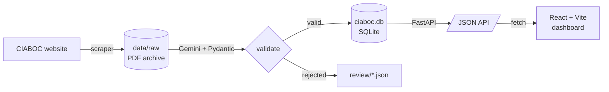

<p align="center">
  
</p>

<h1 align="center">Sri Lanka Anti-Corruption Case Tracker</h1>

<p align="center">
  <em>Turning CIABOC court cause-list PDFs into open, structured, searchable anti-corruption data.</em>
</p>

<p align="center">
  <a href="#-contributing"></a>
  
  
</p>

<h2 align="center">Built with</h2>

<p align="center">
  
  
  
  
  
  
  
  
  
</p>

---

## 📋 About

The **Commission to Investigate Allegations of Bribery or Corruption (CIABOC)** publishes weekly
*cause lists* — PDFs of the corruption cases scheduled in Sri Lankan courts. They are public, but
locked in an awkward tabular PDF format: hard to search, hard to aggregate, easy to ignore.

This project scrapes those PDFs, extracts every hearing into a clean relational database, and serves
it through an API and an interactive dashboard — so journalists, researchers, and citizens can ask
questions like *"which institutions appear most often?"* or *"is this suspect scheduled again?"*

> **Mission:** make Sri Lankan anti-corruption proceedings transparent, queryable, and permanently open.

## ✨ Features

- **📄 Automated ingestion** — scraper pulls weekly CIABOC PDFs into an immutable `data/raw/` archive.
- **🤖 LLM extraction** — Google Gemini reads each PDF into structured JSON, validated by Pydantic.
- **📐 Deterministic court resolution** — the applicable court (MC / HC / CA-SC) is decided from the
  asterisk's **column position** in the PDF, not the LLM's guess, so classification is reliable.
- **🧑‍⚖️ Identity resolution** — the same person under spelling/abbreviation variants is linked to one
  canonical record via reviewed aliases.
- **🛟 Never drops data** — rows that fail validation are written to a review queue, never silently lost.
- **⚡ Read-only API** — FastAPI over SQLite with summary stats, filtered case listings, and search.
- **📊 Interactive dashboard** — React + Recharts: hearings-over-time, court-level composition,
  most-implicated institutions, repeat suspects, cross-filter drill-downs, light/dark theme.

## 🏗️ Architecture



| Layer | Stack | Path |
|-------|-------|------|
| Scraper | Python · urllib | `scraper/` |
| Pipeline | Python · Google Gemini · Pydantic · pdfplumber | `pipeline/` |
| Storage | SQLite | `data/processed/ciaboc.db` |
| API | FastAPI · Uvicorn | `api/` |
| Dashboard | React 18 · Vite · Recharts | `dashboard/` |

## 📂 Project structure

```text
data/
├── raw/                     # Immutable PDFs downloaded from CIABOC
└── processed/
    ├── ciaboc.db            # SQLite database created by the pipeline
    └── review/              # Rejected rows requiring manual review
scraper/                     # Downloads PDFs into data/raw/
pipeline/
├── ciaboc_pipeline.py       # PDF → Gemini → validate → SQLite
├── identity_resolution.py   # Canonical person linking / aliases
├── backfill_court_levels.py # Re-derive court levels from PDF geometry
└── check_db.py              # Quick DB inspection
api/                         # Serves ciaboc.db as JSON (FastAPI)
dashboard/                   # React frontend (talks only to the API)
notebooks/                   # Exploration against the same ciaboc.db
docs/                        # Documentation and assets
```

## 🚀 Getting started

### Prerequisites
- Python 3.11+
- Node.js 18+
- A Google **Gemini API key** (only needed to *extract* new PDFs, not to run the API/dashboard)

### 1 · Download cause lists
```powershell
py -3 scraper/download_ciaboc_pdfs.py
```
Downloads available weekly PDFs into `data/raw/`; unavailable weeks are logged to
`data/raw/missing_weeks.txt`.

### 2 · Process a PDF into the database
```powershell
pip install google-genai pydantic pdfplumber
$env:GEMINI_API_KEY = "your-key"
py -3 pipeline/ciaboc_pipeline.py data/raw/20260112_-_20260116.pdf
```
Validated rows land in `data/processed/ciaboc.db`; rejected rows go to `data/processed/review/`.

### 3 · Run the API
```powershell
pip install fastapi uvicorn
py -3 -m uvicorn api.main:app --reload --port 8000
```
Interactive docs at **http://127.0.0.1:8000/docs**.

### 4 · Run the dashboard
```powershell
cd dashboard
npm install
npm run dev
```
Opens on **http://localhost:5173** and proxies `/api` to the FastAPI backend.

## 🤝 Contributing

<p align="center">
  
</p>

**This is an open-source civic-tech project and we'd love your help.** Whether you write Python,
build React UIs, care about data quality, or just spotted a typo — there's a place for you.

### Ways to contribute
| Area | Examples |
|------|----------|
| 🐍 **Pipeline** | improve extraction accuracy, add PDF-layout edge cases, more validation rules |
| ⚛️ **Dashboard** | new visualizations, accessibility, mobile polish, i18n (Sinhala / Tamil) |
| 🔌 **API** | new endpoints, pagination, performance, tests |
| 🧹 **Data quality** | review the `review/` queue, verify court levels, fix identity aliases |
| 📖 **Docs & design** | tutorials, screenshots, diagrams, this README |
| 🧪 **Testing / CI** | unit tests, GitHub Actions, linting |

### How to get started
1. **Fork** the repo and create a branch: `git checkout -b feat/short-description`
2. Set up the component you're touching (see [Getting started](#-getting-started)).
3. Make your change with clear, focused commits.
4. **Open a Pull Request** describing *what* changed and *why*. Screenshots welcome for UI work.

> 🔰 New here? Look for issues labeled **`good first issue`** — they're scoped to be approachable.

### Guidelines
- Keep PRs focused; smaller is easier to review and merge.
- Match the existing code style (the pipeline and API are heavily commented on purpose — keep it that way).
- **Never commit** API keys, or personal data beyond what the public CIABOC lists already contain.
- Be respectful. This project deals with public-interest data; accuracy and good faith matter.

See **[CONTRIBUTING.md](CONTRIBUTING.md)** for the full guide.

## 🗺️ Roadmap
- [ ] Backfill all historical CIABOC cause lists
- [ ] Automated weekly ingestion (scheduled)
- [ ] Full-text search across suspects and institutions
- [ ] Sinhala & Tamil UI translations
- [ ] Public hosted deployment
- [ ] Test suite + CI

## ⚠️ Disclaimer
Data is derived from **public** CIABOC court cause lists. Automated extraction can contain errors;
figures here are **not** an official record and should be verified against primary sources before
publication. Appearing in a cause list is **not** a finding of guilt.

## 📜 License
No license has been chosen yet — until one is added, default copyright applies. If you'd like to help
pick an appropriate open-source license (e.g. MIT / Apache-2.0), please open an issue.

## 🙏 Acknowledgements
- **CIABOC** — Commission to Investigate Allegations of Bribery or Corruption, Colombo 07, for
  publishing the source cause lists.
- Every contributor who helps keep this data open.
